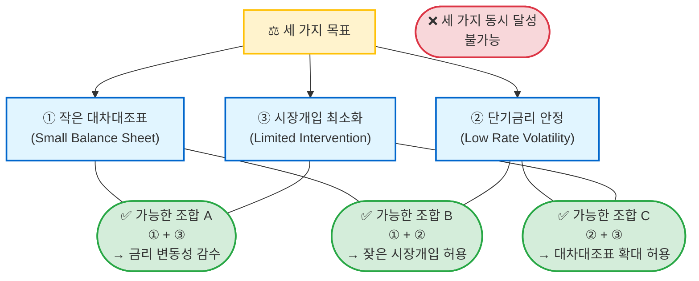
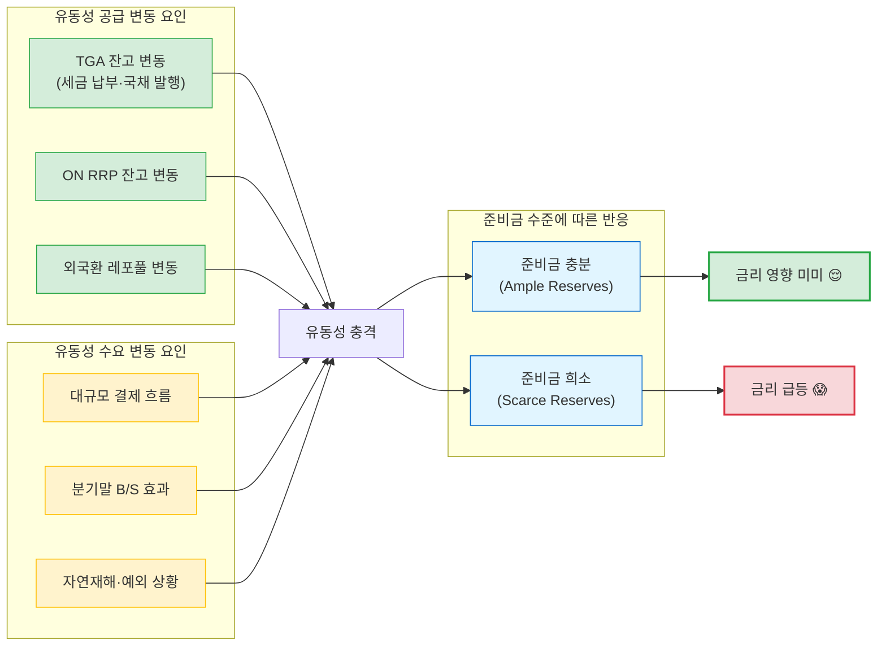
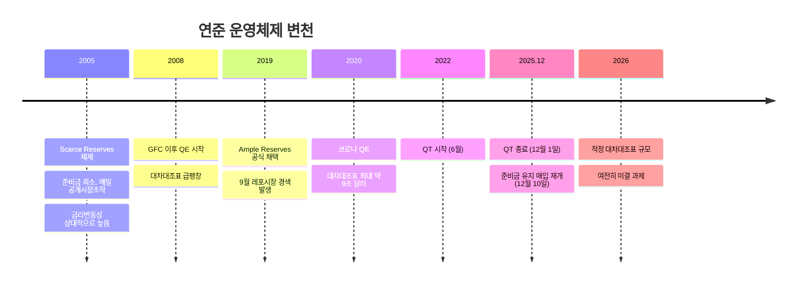

연준의 대차대조표는 왜 줄이기 어려운가? 2026년 1월 연준 이코노미스트들이 발표한 FEDS Notes는 이 질문에 대해 **"트릴레마(Trilemma)"** 라는 깔끔한 프레임워크로 답합니다.

원문: [The Central Bank Balance-Sheet Trilemma](https://www.federalreserve.gov/econres/notes/feds-notes/the-central-bank-balance-sheet-trilemma-20260114.html) — Burcu Duygan-Bump & R. Jay Kahn (2026)

---

## 배경: 6년 만에 8배

2005년 약 8,000억 달러였던 연준 대차대조표는 2025년 말 약 6.5조 달러까지 불어났습니다. GDP 대비로는 6% → 21% 수준입니다. 주된 원인은 두 가지입니다.

1. **양적완화(QE)**: 글로벌 금융위기(2008) 및 코로나19(2020) 이후, 단기금리가 제로에 묶인 상황에서 장기금리를 추가로 낮추기 위해 국채·MBS를 대규모 매입
2. **운영체제 전환(2019)**: 준비금 희소(scarce reserves) 체제 → 준비금 충분(ample reserves) 체제로 구조적 전환

연준은 2022년 6월부터 양적긴축(QT)을 시작해 2025년 12월 1일 종료했고, 10일 후에는 다시 "준비금 유지 목적의 자산 매입"을 시작했습니다. 결국 **적정 대차대조표 규모는 여전히 미결 과제**입니다.

---

## 트릴레마란

중앙은행 대차대조표 트릴레마의 핵심 주장은 단순합니다.

> 중앙은행은 다음 세 가지 목표 중 **동시에 두 가지만** 달성할 수 있다.

---

## 왜 트릴레마가 발생하는가

핵심 메커니즘은 **준비금(Reserves) 수요의 비선형성**에 있습니다.

은행은 결제 의무와 내부 유동성 수요를 충당하기 위해 준비금을 버퍼로 보유합니다. 이 버퍼가 줄어들수록, 작은 충격에도 단기금리가 크게 흔들립니다.

실증 데이터도 이를 뒷받침합니다. Gissler et al. (2025) 연구에 따르면, 준비금이 줄어들수록 레포금리(TGCR)가 TGA 변동에 더 민감하게 반응하며, 변동성도 함께 상승합니다. 2019년 9월 레포시장 경색이 대표적인 사례입니다.

---

## 세 가지 선택지와 비용

### ① 대차대조표 확대 허용 (현재 ample reserves 체제)

**장점**
- 민간이 대규모 준비금 버퍼로 충격 흡수 → 금리 안정
- 잦은 시장개입 불필요
- 안전 공공자산 공급 → 금융안정성 기여

**단점**
- 은행간 대출, MMF→딜러 대출 등 민간 단기금융시장 위축 (가격발견 기능 약화)
- 장기자산을 단기부채(준비금)로 조달 → 듀레이션 리스크
- 금리 상승 시 IORB/ON RRP 비용 증가 → 재무부 납부금(remittance) 감소 또는 마이너스 전환

### ② 금리 변동성 허용 (과거 scarce reserves 체제)

**장점**
- 대차대조표 규모 최소화
- 준비금이 금리로 배분 → 시장규율 강화, 레버리지 억제

**단점**
- 정책금리 통제력 약화 → 통화정책 전달 복잡화
- 단기금리 불확실성이 장기금리의 기간 프리미엄 상승으로 전파
- 극단적 변동성은 레버리지 투자자 포지션 강제청산 유발 가능 (2019.9, 2020.3 사례)

### ③ 잦은 시장개입 허용

**장점**
- 평소엔 작은 대차대조표, 필요시 개입으로 금리 안정
- 능동적 공개시장조작 + 상시레포(SRP)/ON RRP 등 수동 도구 활용 가능

**단점**
- **능동적 개입**: 예측 불가 충격(해외 공식 유동성 수요 변화, 대규모 마진콜, 자연재해 등)은 규모·방향 파악 자체가 어려움 → 잘못된 개입이 오히려 변동성 증폭
- **수동적 시설 의존**: SRP·ON RRP 상시 활용도 대차대조표와 유사한 "시장규율 약화" 우려

---

## 각 체제의 비교 요약

| 구분 | 대차대조표 규모 | 금리 변동성 | 시장개입 빈도 | 민간시장 활력 |
|------|:-----------:|:---------:|:----------:|:----------:|
| **Ample Reserves** | 🔴 大 | 🟢 Low | 🟢 Low | 🔴 약화 |
| **Scarce Reserves** | 🟢 小 | 🔴 High | 🟡 Medium | 🟢 활발 |
| **Active Operations** | 🟡 中 | 🟡 Medium | 🔴 High | 🟡 보통 |

---

## 연준의 현재 위치

QT가 끝난 지금, 연준은 어느 꼭짓점으로 가야 할지 결정해야 합니다. 논문 저자들은 "내부적 해법(interior solution)"도 가능하다고 언급합니다. 즉, 일부 금리 변동성(분기말 등)을 감수하고, 소규모 추가 개입도 허용하며, 대차대조표도 약간 크게 유지하는 **절충점**입니다. 다만 어느 방향으로도 트릴레마의 근본 구조는 바뀌지 않습니다.

---

## 생각

이 논문이 흥미로운 이유는 "트릴레마"라는 개념 자체가 의사결정을 매우 명료하게 만들어 준다는 점입니다. 국제 금융의 먼델-플레밍 트릴레마(고정환율 + 자본이동 자유화 + 독립적 통화정책은 동시에 불가)처럼, 중앙은행 운영에도 근본적인 제약이 있다는 걸 보여줍니다.

실무적으로는 두 가지가 눈에 들어옵니다.

첫째, **"대차대조표 축소 = 좋은 것"이라는 단순한 도식이 틀렸다**는 점입니다. 준비금이 충분히 클 때 얻는 안정성에는 명백한 가치가 있습니다. 문제는 그 비용(시장 왜곡, 듀레이션 리스크, 재무부 납부금 감소)을 어느 수준까지 감내할 것이냐는 가치 판단입니다.

둘째, **시장개입 도구의 설계가 갈수록 중요해진다**는 점입니다. SRP나 ON RRP 같은 수동적 시설은 대차대조표를 유연하게 만들어주지만, 이것도 과도하게 사용하면 민간시장을 대체해버리는 역설적 상황을 만듭니다. "얼마나 자주, 어느 방향으로 개입할 것인가"라는 질문은 기술적 문제가 아닌 정치경제학적 문제이기도 합니다.

결국 연준이 이 트릴레마에서 선택할 꼭짓점은 경제학뿐 아니라 연준의 역할에 대한 사회적 합의에도 달려 있습니다.
