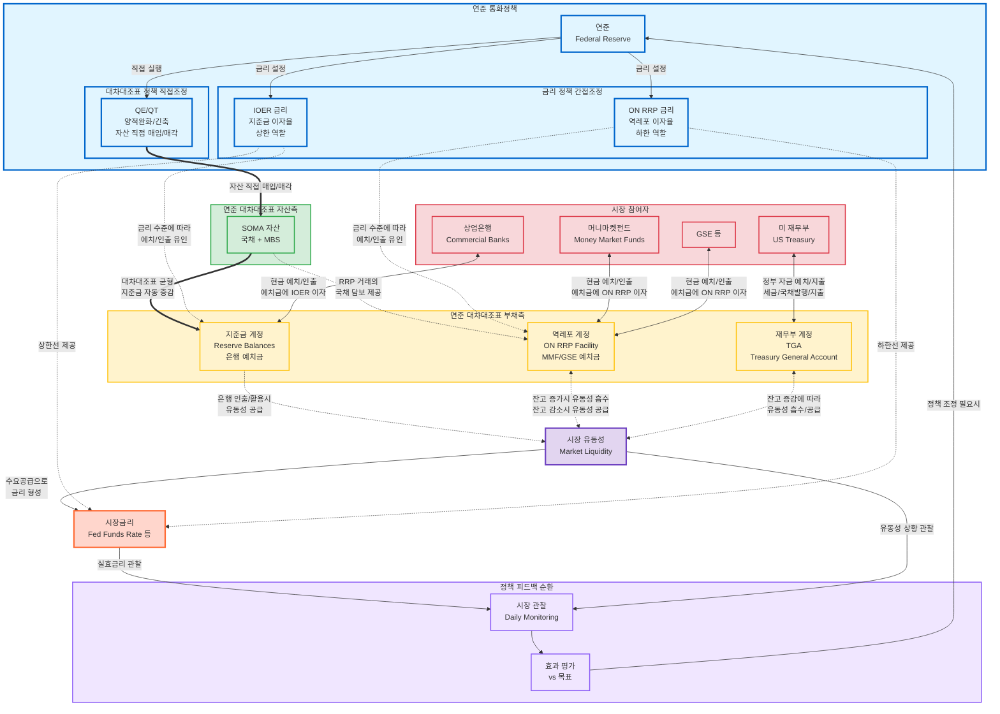

## 연준 통화정책의 전체 구조

연준(Federal Reserve)의 통화정책은 크게 **금리 정책**(간접 조정)과 **대차대조표 정책**(직접 조정)으로 나뉩니다. 이 두 축이 연준의 부채 계정들, 시장 참여자들, 그리고 시장 유동성과 금리에 어떻게 연결되는지를 하나의 다이어그램으로 정리해 보았습니다.

## 핵심 구조 요약

### 두 가지 정책 축

- **금리 정책 (간접 조정)**: IOER과 ON RRP 금리를 설정하여 시장금리의 상한과 하한을 형성합니다. 시장 참여자들이 자발적으로 반응하도록 유인하는 간접적인 방식입니다.
- **대차대조표 정책 (직접 조정)**: QE/QT를 통해 국채와 MBS를 직접 매입하거나 매각합니다. 이는 연준 대차대조표의 자산측을 변동시키고, 부채측(지준금)이 자동으로 따라 움직입니다.

### 연준 대차대조표의 부채측 3대 계정

| 계정 | 참여자 | 유동성 효과 |
|------|--------|------------|
| **지준금 (Reserve Balances)** | 상업은행 | 은행이 인출/활용 시 시장에 유동성 공급 |
| **역레포 (ON RRP)** | MMF, GSE | 잔고 증가 = 유동성 흡수, 감소 = 유동성 공급 |
| **TGA** | 미 재무부 | 세금 징수/국채 발행 시 흡수, 정부 지출 시 공급 |

### 피드백 루프

연준은 실효 연방기금금리(EFFR)와 시장 유동성 상황을 매일 관찰하며, 목표 대비 괴리가 발생하면 금리 조정 또는 공개시장조작을 통해 정책을 미세 조정합니다.
